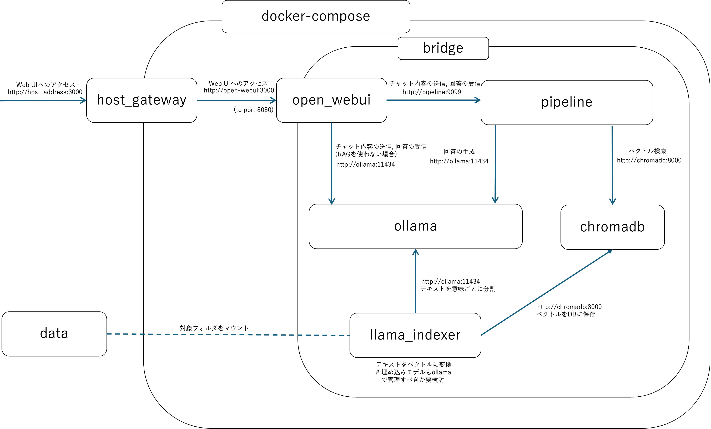
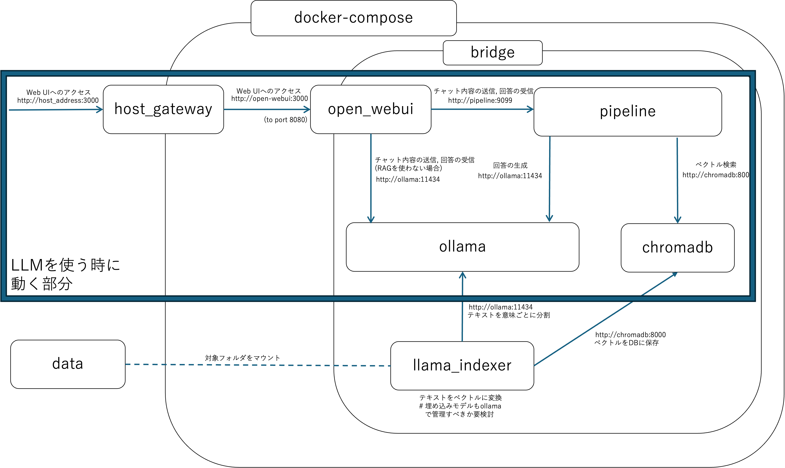
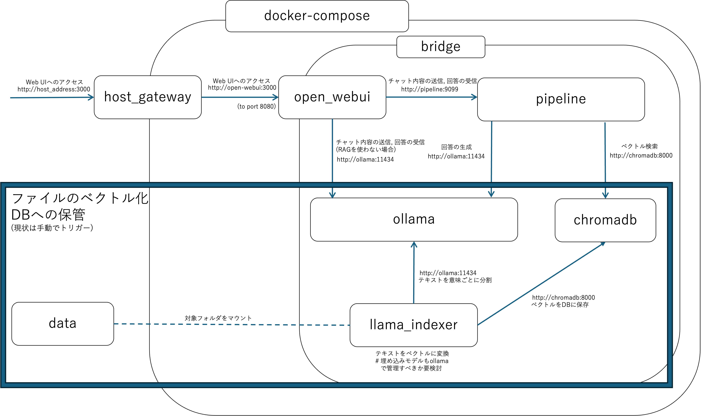

# Lab-Knowledge RAG Prototype

## 概要

このプロジェクトは、研究室内に蓄積された発表スライドや論文PDFなどの資料を、対話形式で検索・活用するためのRAG (Retrieval-Augmented Generation) 機能付きローカルLLMプロトタイプです。

過去の研究資産へのアクセス性を高め、新たな着想の獲得や議論の活性化を目的としています。

---

> **⚠️ 注意**
>
> このシステムは現在開発中の**プロトタイプ**です。
> * 予期せぬバグや、意図しない挙動を示す可能性があります。
> * 機能は限定的であり、今後変更される予定です。
> * 利用にあたっては、以下の手順をよくご確認ください。

---


## 🏛️ システム構成

このシステムは、以下のオープンソースソフトウェアをDocker Composeで連携させて構築されています。

* **Web UI:** [Open WebUI](https://github.com/open-webui/open-webui) - チャットを行うためのフロントエンドです。
* **LLM実行環境:** [Ollama](https://github.com/ollama/ollama) - 大規模言語モデル(LLM)をローカルで実行します。
* **ベクトルDB:** [ChromaDB](https://github.com/chroma-core/chroma) - ドキュメントのベクトルデータを保存・管理します。
* **データインデクサー:** [LlamaIndex](https://github.com/run-llama/llama_index) - ドキュメントを読み込み、ベクトル化してChromaDBに保存するためのカスタムサービスです([`llamaindexer/code/get_index_for_RAG.py`](uchida-r/my_llm/My_LLM-d1772139c812d03a15b9c19e63bc76296601977d/llamaindexer/code/get_index_for_RAG.py))。
* **パイプライン (オプション):** [Pipelines](https://github.com/open-webui/pipelines) - Open WebUIとバックエンド間の通信を仲介します。

<details>
<summary>ネットワーク図 (クリックで展開)</summary>







</details>

## ✨ 特徴

* **ローカル実行:** すべてのコンポーネントとLLMモデルがローカル環境で動作するため、外部APIは不要で、機密性の高い研究データも安心して扱えます。
* **ドキュメント同期:** 起動時に既存のドキュメントとベクトルDBの状態を比較し、新規・更新されたファイルのみを自動でインデックスする同期機能を備えています。
* **OSSベース:** 実績のあるオープンソースのみで構成されており、透明性と拡張性に優れています。

## ⚙️ 動作要件

* **GPU環境:** LLMを快適に動作させるためにGPU環境を強く推奨します。
* **Docker & Docker Compose:** 各サービスをコンテナとして管理・実行するために必須です。
* **Git:** リポジトリのクローンに必要です。

## 🚀 セットアップと使い方

### Step 1: 環境構築

1.  **リポジトリをクローンして移動**
    ```bash
    git clone [このリポジトリのURL]
    cd [リポジトリ名]
    ```


### Step 2: システムの起動とデータ準備

1.  **資料の配置**
    `data` フォルダに、LLMに読み込ませたいスライド(`.pptx`)やPDFファイル(`.pdf`)を格納します。

2.  **システムの起動**
    ```bash
    docker compose up
    ```
    > **☕️ 初回起動時の注意**
    > 初めてこのコマンドを実行する際、LLMモデルのダウンロードも開始されます。完了までには**非常に長い時間**がかかる場合があります。気長にお待ちください。

### Step 3: ドキュメントのベクトル化

システムを起動したまま、**別のターミナル（bash）**を開き、同じディレクトリで以下のコマンドを実行します。これにより、`data`フォルダ内のファイルがベクトル化され、LLMが検索できるデータベースに保存されます。

```bash
docker compose exec llama_indexer bash -c "python3 get_index_for_RAG.py"
```

### Step 4:Web UIの設定

1. **Open WebUIにアクセス**
    Webブラウザで http://[ホストマシンのIPアドレス]:3000 を開きます。
    (Dockerを動かしているPC上でブラウザを開く場合は http://localhost:3000 です)

2. **pipelineへの接続**
    右上のアカウント名-> 管理者パネル-> 設定-> 接続へと進みます。
    OpenAI API接続の管理の項目の右側にある ＋ ボタンをクリックします
    以下の情報を入力します。
        URL: http://pipeline:9099
        キー: 0p3n-w3bu!
    入力後、右下の「保存」ボタンを押します。

3. **モデルの選択**
    チャットのメイン画面に戻ります。
    画面上部にある「モデルを選択」のドロップダウンメニューから llamaindex_ollama_pipeline を選択します。

4. **チャット開始！**
    以上で全ての設定は完了です！
    チャット入力欄に、dataフォルダに入れた資料に関する質問をしてみてください。
